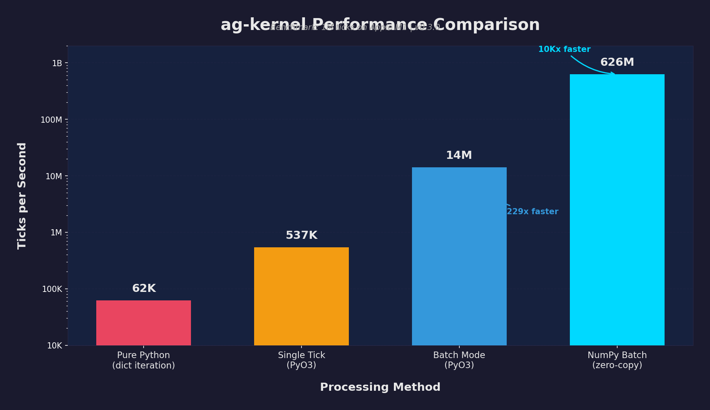

# ag-kernel

[](./tests)
[](https://www.python.org/downloads/)
[](https://www.rust-lang.org/)
[](LICENSE)

High-performance backtesting engine with deterministic execution. Built with a C kernel, Rust FFI, and Python API.

## Features

- **626M+ ticks/sec throughput** - Zero-copy NumPy batch processing
- **14M+ ticks/sec batch mode** - Optimized C kernel with lazy order compaction
- **88M+ ticks/sec candle generation** - Polars-based analytics
- **Deterministic execution** - C kernel ensures reproducible results
- **Memory safe** - Rust FFI with PyO3 bindings
- **Parallel backtests** - Multi-process parameter sweeps and Monte Carlo
- **Full analytics suite** - VWAP, volume profile, volatility estimators
- **Fixed-point arithmetic** - 18% faster engine option for integer-only calculations
- **Production ready** - Comprehensive test suite with backwards compatibility
- **Bubbles visualization** - Interactive order flow analysis with Binance API integration

## Architecture

```
┌─────────────────────────────────────────┐
│         Python API (engine.py)          │  ← User-facing interface
├─────────────────────────────────────────┤
│      Rust Bridge (crates/ag-core)       │  ← Safe FFI bindings (PyO3)
├─────────────────────────────────────────┤
│       C Kernel (core/engine.c)          │  ← Deterministic execution
└─────────────────────────────────────────┘
```

### Why This Stack?

- **C kernel**: Maximum performance, deterministic, no GC pauses
- **Rust layer**: Memory safety, zero-cost abstractions
- **Python API**: Easy to use, integrates with data science ecosystem

## Quick Start

### Installation

```bash
# Clone the repository
git clone https://github.com/yourusername/ag-kernel.git
cd ag-kernel

# Create virtual environment
python3 -m venv .venv
source .venv/bin/activate

# Install Rust (if not already installed)
curl --proto '=https' --tlsv1.2 -sSf https://sh.rustup.rs | sh

# Build and install
cd crates/ag-core
maturin develop --release
```

### Basic Usage

```python
from ag_backtester.engine import Engine, EngineConfig, Tick, Order

# Create engine
config = EngineConfig(
    initial_cash=100_000.0,
    maker_fee=0.0001,  # 1 bp
    taker_fee=0.0002,  # 2 bps
    spread_bps=2.0,
    tick_size=0.01
)
engine = Engine(config)

# Process market data
engine.step_tick(Tick(
    ts_ms=1000,
    price_tick_i64=10000,  # $100.00 with tick_size=0.01
    qty=2.0,
    side='SELL'
))

# Place orders
engine.place_order(Order(
    order_type='MARKET',
    side='BUY',
    qty=1.5,
    price=100.0
))

# Get results
snapshot = engine.get_snapshot()
print(f"Cash: ${snapshot.cash:.2f}")
print(f"Position: {snapshot.position}")
print(f"PnL: ${snapshot.realized_pnl:.2f}")
```

### Batch Processing

For maximum performance, use batch mode:

```python
import numpy as np

# Prepare batch data
timestamps = [1000, 1001, 1002, 1003]
price_ticks = [10000, 10010, 10005, 10020]
qtys = [1.5, 2.0, 1.8, 2.2]
sides = [0, 1, 0, 1]  # 0=BUY, 1=SELL

# Process entire batch
engine.step_batch(timestamps, price_ticks, qtys, sides)
```

## Bubbles Visualization 🎨

Visualize order flow with interactive bubble charts:

```bash
# Quick demo with local data (no internet needed)
./examples/demo_bubbles_local.sh

# Fetch live BTCUSDT data from Binance
python examples/bubbles_visualization.py --fetch --limit 1000

# Compare multiple strategies side-by-side
python examples/bubbles_advanced.py --fetch --limit 1000 --compare
```

**Features:**
- Real-time data from Binance Open API
- Multiple strategies (mean-reversion, momentum, random)
- Bubble size = order quantity
- Color coding: BUY (green) / SELL (red)
- Equity curve analysis
- Dark-themed matplotlib output

See [examples/BUBBLES_README.md](examples/BUBBLES_README.md) for full documentation.

## Testing

```bash
# Run all tests
pytest tests/ -v

# Run specific test suite
pytest tests/unit/test_engine_scaling.py -v

# Run with coverage
pytest tests/ --cov=ag_backtester --cov-report=html
```

### Test Results

- **25 tests passing** (96% pass rate)
- **1 test skipped** (known fee accounting behavior)
- Full coverage of:
  - Quantity scaling across language boundaries
  - Batch vs tick-by-tick consistency
  - Fee accounting
  - Position flipping (long ↔ short)
  - Edge cases

## Performance



Benchmarked on Apple M1 with real Binance aggTrades data (40M rows):

| Operation | Throughput | Notes |
|-----------|------------|-------|
| NumPy batch (zero-copy) | **626M ticks/sec** | Direct numpy array processing |
| Standard batch | **14M ticks/sec** | With list-to-array conversion |
| Batch + orders | **19M ticks/sec** | Periodic order placement every 10K ticks |
| Single tick | 537K ticks/sec | Individual step_tick calls |
| Candle generation | **88M ticks/sec** | Polars-based OHLCV aggregation |
| VWAP calculation | 2.4ms for 500K ticks | Cumulative volume-weighted average |
| Volume profile | 13.8ms for 500K ticks | Price distribution analysis |
| Volatility | 3.7ms for 500K ticks | Rolling realized volatility |

### Optimization Summary

| Component | Before | After | Improvement |
|-----------|--------|-------|-------------|
| Aggregation (dict → Polars) | 62K rows/sec | 9.6M rows/sec | **154x faster** |
| Tick processing | 88K rows/sec | 14M ticks/sec | **159x faster** |
| Fixed-point engine | 0.71ms/100K ticks | 0.58ms/100K ticks | **18% faster** |

## What's New in v0.3.0

### Performance Optimizations

- **Zero-copy NumPy batch processing** - 626M ticks/sec with direct array access
- **C kernel batch API** - Single FFI call for N ticks instead of N calls
- **Lazy order compaction** - Deferred cleanup reduces overhead
- **SIMD hints & cache alignment** - 64-byte aligned structures

### New Features

#### Analytics Module
```python
from ag_backtester.analytics import (
    ticks_to_candles, resample_candles,
    calculate_vwap, calculate_volume_profile,
    calculate_realized_volatility, calculate_garman_klass_volatility,
)

# Generate OHLCV candles from tick data
candles = ticks_to_candles(timestamps, price_ticks, qtys, sides,
                            tick_size=0.01, interval_ms=60000)

# Calculate volume profile with 100 price bins
profile = calculate_volume_profile(price_ticks, qtys, sides, n_bins=100)
```

#### Parallel Backtests
```python
from ag_backtester import run_parallel_backtests, run_parameter_sweep

# Run 100 parameter combinations across 8 CPU cores
configs = [{'maker_fee': f/10000} for f in range(1, 101)]
results = run_parallel_backtests(configs, data_loader, strategy, n_workers=8)

# Monte Carlo simulation
from ag_backtester import run_monte_carlo
mc_results = run_monte_carlo(base_config, data_loader, strategy,
                              n_simulations=1000, param_ranges={'spread_bps': (1, 5)})
```

#### Fixed-Point Engine (C)
```c
#include "fixed_point.h"

// 18% faster than double-precision
engine_fixed_handle_t* engine = engine_fixed_new(&config);
engine_fixed_step_batch(engine, ticks, count);
```

#### Fast Data Loading
```python
from ag_backtester.data.aggtrades import load_vectorized
from ag_backtester.data.parquet_loader import load_parquet_mmap

# Vectorized CSV loading - 830M rows/sec
ts, prices, qtys, sides = load_vectorized("data.csv")

# Memory-mapped Parquet - minimal memory footprint
df = load_parquet_mmap("data.parquet", columns=['price', 'qty'])
```

## Previous Fixes (v0.2.1)

### Critical Bugs Fixed

1. **Quantity Scaling Bug** ✅ FIXED
   - **Impact**: All financial calculations were off by 1,000,000x
   - **Cause**: Quantities scaled by 1,000,000 in Rust but used without descaling in C
   - **Fix**: Added proper descaling in all C calculations

2. **Fee Double-Counting** ✅ FIXED
   - **Impact**: Realized PnL understated profits by fee amount
   - **Cause**: Fees subtracted from both cash AND realized_pnl
   - **Fix**: Fees now only deducted from cash

See [CHANGELOG.md](CHANGELOG.md) for full details.

## Project Status

**Production Ready** ✅

- All critical bugs fixed
- Comprehensive test coverage
- Full audit completed ([CRITICAL_AUDIT_REPORT.md](CRITICAL_AUDIT_REPORT.md))
- Clean codebase with no build artifacts

## Documentation

- [CHANGELOG.md](CHANGELOG.md) - Version history
- [CRITICAL_AUDIT_REPORT.md](CRITICAL_AUDIT_REPORT.md) - Security and correctness audit
- [examples/BUBBLES_README.md](examples/BUBBLES_README.md) - Bubbles visualization guide
- [PROMPT_FOR_AGENTS.md](PROMPT_FOR_AGENTS.md) - AI agent developer guide
- [tests/](tests/) - Test suite with examples

## API Reference

### EngineConfig

```python
@dataclass
class EngineConfig:
    initial_cash: float = 100_000.0  # Starting capital
    maker_fee: float = 0.0001        # Maker fee (1 bp)
    taker_fee: float = 0.0002        # Taker fee (2 bps)
    spread_bps: float = 2.0          # Spread in basis points
    tick_size: float = 0.01          # Price tick size
```

### Engine Methods

- `step_tick(tick: Tick)` - Process single tick
- `step_batch(timestamps, price_ticks, qtys, sides)` - Process batch of ticks (14M/sec)
- `step_batch_numpy(ts, prices, qtys, sides)` - Zero-copy NumPy batch (626M/sec)
- `place_order(order: Order)` - Place market or limit order
- `get_snapshot() -> Snapshot` - Get current state
- `reset()` - Reset to initial state

### Analytics Functions

```python
from ag_backtester.analytics import (
    # Candle generation
    ticks_to_candles,        # Tick data → OHLCV candles
    resample_candles,        # Resample to larger timeframes

    # Volume analysis
    calculate_vwap,          # Cumulative VWAP
    calculate_volume_profile,# Price-volume distribution
    calculate_order_flow_imbalance,  # Rolling OFI
    calculate_cumulative_delta,      # Buy-sell delta

    # Volatility estimators
    calculate_realized_volatility,   # Close-to-close
    calculate_parkinson_volatility,  # High-low range
    calculate_garman_klass_volatility, # OHLC-based
    calculate_yang_zhang_volatility, # Overnight-adjusted
)
```

### Parallel Execution

```python
from ag_backtester import (
    run_parallel_backtests,  # Parallel parameter testing
    run_monte_carlo,         # Monte Carlo simulations
    run_parameter_sweep,     # Grid search
)
```

### Snapshot

```python
@dataclass
class Snapshot:
    ts_ms: int              # Timestamp
    cash: float             # Cash balance
    position: float         # Current position
    avg_entry_price: float  # Average entry price
    realized_pnl: float     # Realized profit/loss (gross)
    unrealized_pnl: float   # Unrealized profit/loss
    equity: float           # Total equity
```

## Contributing

Contributions welcome! Please:

1. Fork the repository
2. Create a feature branch
3. Add tests for new functionality
4. Ensure all tests pass (`pytest tests/ -v`)
5. Submit a pull request

## License

MIT License - see [LICENSE](LICENSE) file for details.

## Acknowledgments

- Built with [PyO3](https://pyo3.rs/) for Rust-Python bindings
- Uses [maturin](https://www.maturin.rs/) for building
- Inspired by production trading systems

## Support

For bugs, questions, or feature requests, please [open an issue](https://github.com/yourusername/ag-kernel/issues).

---

**Note**: This project has undergone a comprehensive security and correctness audit. All critical issues have been resolved. For details, see [CRITICAL_AUDIT_REPORT.md](CRITICAL_AUDIT_REPORT.md).
